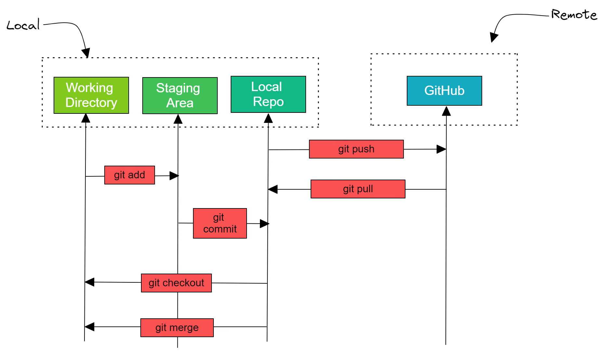

# Git & GitHub - Part 1

## What is Git?

- Git is a version control system that keeps track of changes in code over time, enabling developers to manage and track version history.

## How to Install Git

### Check if Git is Already Installed

```bash
git --version
```

### Install Git on Ubuntu

```bash
sudo apt-get update
sudo apt-get install git
```

### Install Git on Windows

1. Download Git from [git-scm.com](https://git-scm.com).
2. Follow the installation wizard.

## Git Setup

### Set Up Username and Email

```bash
git config --global user.name "<name>"
git config --global user.email "<email>"
```

### Change Default Branch Name

```bash
git config --global init.defaultBranch <name>
```

### Set Default Editor

```bash
git config --global core.editor "<editor>" # e.g., "code --wait"
```

## Creating a Version

### Initialize a Git Repository

```bash
git init
```

### Check the Status of the Repository

```bash
git status
git status -s # Short format
```

### Add Files to the Staging Area

- The staging area lets you select which changes to include in the next commit.

```bash
git add <file> # Add a single file
git add .       # Add all files except those in .gitignore
```

### Commit Changes

- A commit represents a version of your code.

```bash
git commit -m "<message>"       # Add a message to describe the commit
git commit -m "<title>" -m "<description>" # Add a title and optional description
```

_If no message is provided, a text editor will open to write one._

### Check Commit History

```bash
git log                     # Full commit history
git log --all               # All branches' commit history
git log --oneline           # Condensed commit history
git log --oneline --graph   # Condensed history with a graph
```

### Modify the Previous Commit

- Use `amend` to edit the last commit.

```bash
git commit --amend -m "<new message>" # if you don't write a new message, the text editor will open
```

```bash
git commit --amend --no-edit # Keep the same message
```

## Visualizing Git Changes

- Tools like `git status` or integrated IDE features provide visualizations of code changes.

## Staging Area and Working Area

### Workflow: Working Area → Staging Area → Repository

- Move files from working to staging with `git add`.
- Move files from staging to the repository with `git commit`.

### Tracking and Untracking Files

- To track a file: Add it to the staging area and commit.
- To untrack a file: Remove it from the staging area and commit.

### Remove Files from the Staging Area

```bash
git reset <file>             # Remove file from staging area
git restore --staged <file>  # Alternative command
```

### Untrack a File

```bash
git rm --cached <file>
```

### Undo Changes

```bash
git checkout -- <file>  # Undo changes to a file
git restore <file>      # Alternative command
```

_Applies to files not yet staged._

## Working with Commits

### Navigate Between Commits

```bash
git checkout <commit-hash>       # Go to a specific commit
git checkout HEAD~1              # Go to the previous commit
git checkout -                   # Undo the last checkout
git checkout <commit-hash> <file> # Checkout a specific file from a commit
```

_To return to the latest commit:_

```bash
git checkout master
```

### Updating the Previous Commit

Making updates to a past commit creates a new branch.

- View branches with `git log --all --graph`.

## Summary

### Create a Version

1. `git init`
2. `git status`
3. `git add <file>`
4. `git commit -m "<message>"`

### Configure Git

- `git config --global user.name "<name>"`
- `git config --global user.email "<email>"`

### View Commit History

- `git log --all --graph`
- `git checkout <commit-hash|branch-name>`

### Restore to a Previous Commit

- `git checkout <commit-hash|branch-name|HEAD~1> <file|directory>`

## Extra Features

### Aliases

Simplify commands with aliases:

```bash
git config --global alias.<alias-name> "<command>"
```

#### Examples

- `git config --global alias.cm commit -m`
- `git config --global alias.co checkout`
- `git config --global alias.lg "log --all --graph"`

### .gitignore

- Add files or folders you don’t want to track to `.gitignore`.
- Create `.gitignore` in the project root and list files/folders to ignore.

### Remove Git from a Directory

```bash
rm -rf .git
```


