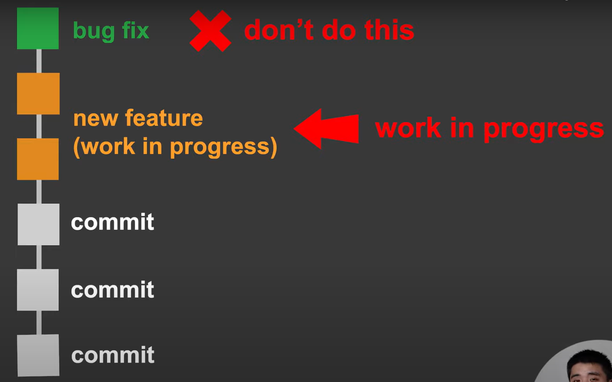
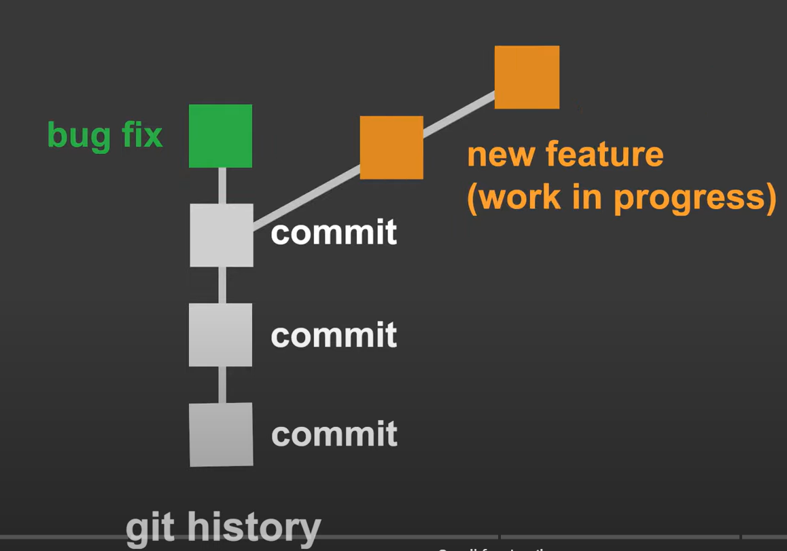
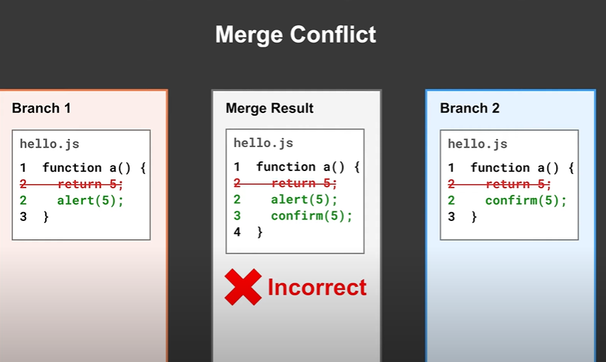
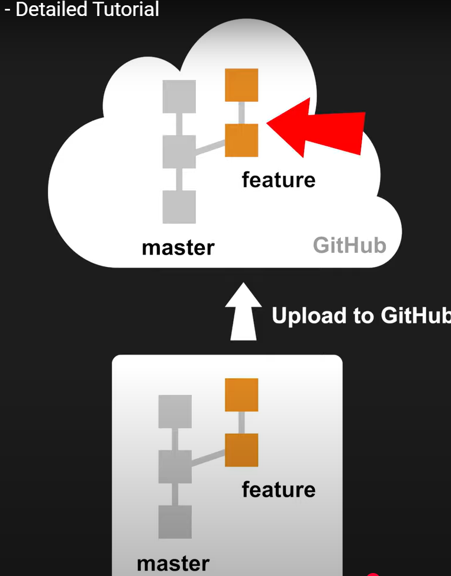
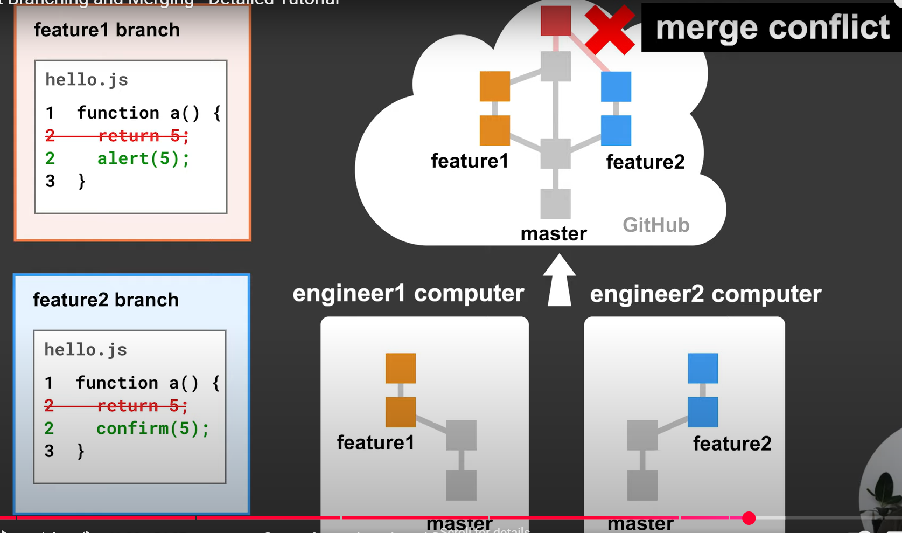

# Git Branching and Merging

## Branching

Imagine you are working on a large feature that requires multiple commits. Suddenly, your manager asks you to fix a critical bug. You don't want to mix your incomplete feature code with the bug fix. Branching solves this by allowing you to:

- Create a new branch for your feature.
- Switch back to the main branch to apply the bug fix.
- Continue working on your feature without interference.



---



---

- Branching = work on multiple features at the same time
- the new branch take a copy of the current branch and you can work on it without affecting the main branch
- you can merge the new branch back to the main branch when you are done

1. Create a new branch `git branch new-branch-name` or `git checkout -b new-branch-name` (this will create a new branch and switch to it)
2. Switch to the new branch `git checkout new-branch-name`
3. Work on the new branch and make commits as usual
4. if you want to make bug fixes on the main branch, switch back to the main branch `git checkout main` and make the changes there
5. then switch back to the new branch and complete your work `git checkout new-branch-name`

- main branch is the branch that will be used to deploy the code
  > List all branches `git branch`

## Merging

- Merging combines changes from different branches into one. This is useful when you finish a feature and want to integrate it back into the main branch.

- The result of a merge is a combination of the changes from both branches.
- The merge go to the branch that you are working on. So if you are working on the new branch, the merge will go to the new branch and not the main branch. You have to switch to the main branch and merge the new branch to the main branch.

1. Switch to the main branch `git checkout main`
2. Merge the new branch to the main branch `git merge new-branch-name` this will open a text editor to write a commit message or you can use `git merge new-branch-name -m "commit message"`
3. Remove the new branch `git branch -d new-branch-name`

## Merge Conflicts

A merge conflict occurs when Git cannot automatically combine changes from different branches, typically because the same part of the code was modified differently.



1. Follow the same merging steps as before.
2. If a conflict occurs, Git will pause the merge and tell you which files have conflicts.
3. Open the conflicting files in your code editor.
4. Manually resolve the conflicts.
5. Add the resolved files `git add .`
6. Continue the merge `git merge --continue` or `git commit -m "Merge message"`
7. Remove the new branch `git branch -d new-branch-name`

## Feature Branch Workflow

- A professional workflow used by teams to manage code changes.
- Involves creating feature branches, uploading them to GitHub, and performing code reviews via pull requests.

1. Create a feature branch. -> `git checkout -b feature-branch-name`
2. Developing the Feature -> make commits
3. Upload the feature branch to GitHub. (all the team members can see our code) -> `git remote add origin <url>` -> `git push origin feature-branch-name`
4. Create a `pull request`. (do code review)
   1. Go to your GitHub repository.
   2. Click on Pull Requests and then New Pull Request .
   3. Compare new-feature with master.
   4. Add a description and submit the pull request.
5. Code Review and Merging (merge happens on GitHub) -> on GitHub click on `pull request` -> `the request` -> `merge pull request` -> `merge pull request` -> `confirm merge`
   1. Teammates review the code and leave comments if necessary.
   2. Once approved, merge the pull request into master.
6. Syncing Local Repository -> `git checkout main` -> `git pull origin main`



### Step of pulling

1. `git fetch origin` -> `git checkout main` -> `git pull`

> `git pull` is a combination of `git fetch` and `git merge`

## Merge Conflicts in feature branches workflow (pull request)

- suppose we are working on two different branches and we want to merge them to the main branch. If there is a conflict, we have to resolve it in the main branch and not in the feature branch.



1. push the two branches to GitHub
2. create a pull request for the first branch
3. create a pull request for the second branch
4. if there is a conflict, resolve it in the main branch you have different options to resolve the conflict
   1. merge on github using web editor
   2. merge on your local machine using command line
      1. `git checkout main`
      2. `git pull origin main`
      3. `git checkout new-branch-name`
      4. `git merge main`
      5. resolve the conflict
      6. `git add .`
      7. `git commit -m "merge message"` or `git merge --continue`
      8. `git push origin new-branch-name`

> if want to stop the merge `git merge --abort`

## Commit Message Best Practices (Conventional Commits)

- A commit message is a brief description of changes made in a commit.
- Conventional Commits is a commit message convention that makes it easier to understand the changes in a repository.

Example of a conventional commit message:

```
feat: add new feature
```

- The message consists of a type and a description.
- The type can be `feat`, `fix`, `docs`, `style`, `refactor`, `test`, or `chore`.
- The description is a brief summary of the changes made.
- The message is written in the present tense.

top 10 examples of commit messages:

1. `feat: add new feature`
2. `fix: resolve issue`
3. `docs: update documentation`
4. `style: format code`
5. `refactor: improve code`
6. `test: add tests`
7. for merge commits `Merge branch 'feature-branch'`
8. for revert commits `Revert "commit message"`
9. for initial commit `Initial commit`
10. for resolving conflicts `resolve conflicts`
