# Git for Professionals

## The Perfect Commit

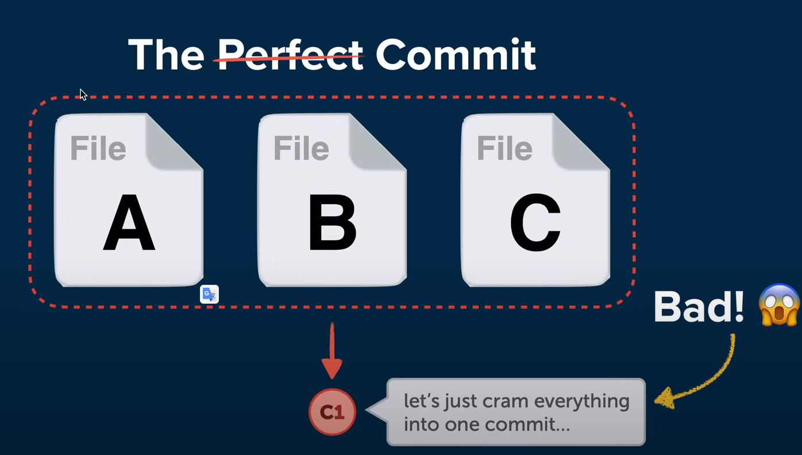

---

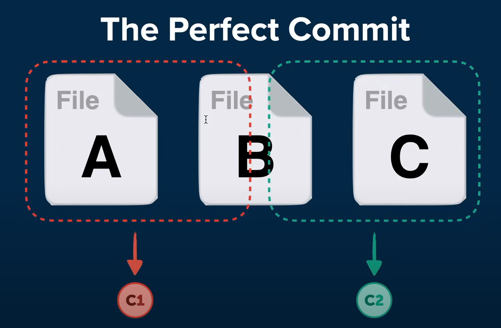

---

- Add the right changes.
  - The goal is to create a commit that makes sense—one that only includes changes from a single topic. Avoid cramming all your current local changes into the next commit.
  - Selectivity is Key: Being selective and carefully deciding what should go into the next commit is crucial. This approach separates different topics, making it easier to understand both for your colleagues and yourself in the future.
  - Using the Staging Area: Git's staging area concept is helpful here. It allows you to select specific files or even parts of those files for the next commit. You can leave others for future commits.
- Compose a good commit message.

1.  `git status` to see the changes.
2.  `git add <file>` to stage the changes. You can also use `git add .` to stage all changes, but we need to add just the right changes.
3.  `git diff` to see the changes that are staged. or `git diff <file>` to see the changes in a specific file. This command shows the difference between the working directory and the staging area.
4.  `git add -p` to interactively stage changes. This command allows you to select parts of a file to stage. (You might see two parts or chunks of changes. Let's say the first one belongs to the next commit's topic, but not the second one.)

## The Perfect Commit Message

- Subject: concise summary of what happened.
- body: more detailed explanation.

  - what is now different?
  - what's the reason for the change?
  - Is there anything to watch out for/ anything particularly remarkable?

- `git commit` will open your default editor to write the commit message.

Subject Line: Write something concise, less than 80 characters if possible. The subject should be a brief summary of what happened.

Body of the Message: After an empty line, Git knows you're writing the body of the message, where you can provide a detailed explanation. Answer questions like:

- What's now different than before?
- What's the reason for the change?
- Is there anything to watch out for?

## Branching Strategies

### A Written Convention

Agree on a Branching Worflow in Your Team

- Git allows you to create branches - but it doesn't tell you how to use them!
- You need a written best practice of how work is ideally structured in your team - to avoid mistakes & collisions.
- It highly depends on your team / team size, on your project, and how you handle releases.
- It helps to onboard new team members ("this is how we work here").

If you work in a team, establish a clear convention on how to work with branches and document it. This helps avoid mistakes and collisions and aids in onboarding new team members.

### Types of Branches

- Long-Running Branches: These exist throughout the project's lifecycle, such as `main` or `master`. Other examples include `develop` or `production`.
- Short-Lived Branches: Created for specific purposes and deleted after integration. Examples include feature branches, bug fixes, or experiments.

> - Commit never directly to `main` or `master`! it's make through integration (`merge` or `rebase`) from a feature branch or `pull request`.
> - Short-lived will be deleted after integration

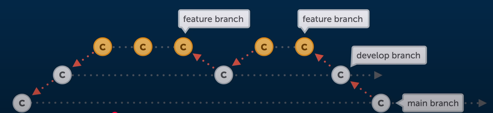

### Popular Branching Strategies

- GitHub Flow: Extremely lean and simple. Only one long-running branch (`main`), and all active work is done in short-lived branches.
  - 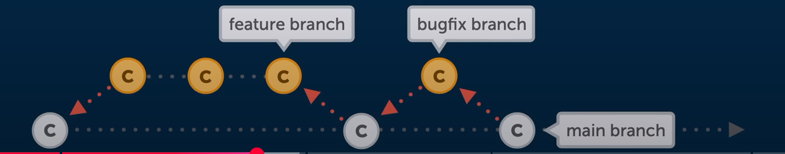
- Git Flow: Offers more structure and rules. Includes a `main` branch reflecting production state, a `develop` branch, feature branches, release branches, and hotfix branches.
  - 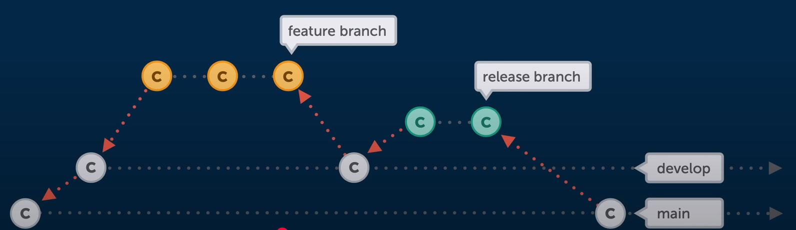

## Pull Requests

Pull requests are not a core Git feature but are provided by Git hosting platforms like GitHub, GitLab, Bitbucket, etc. They facilitate communication and code review.

### Why Use Pull Requests?

- Code Review: Have a second pair of eyes look over your code.
- Contributing to Repositories: Contribute to repositories you don't have direct access to by forking and opening pull requests.

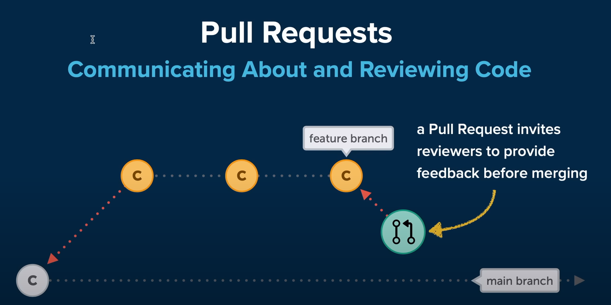

---

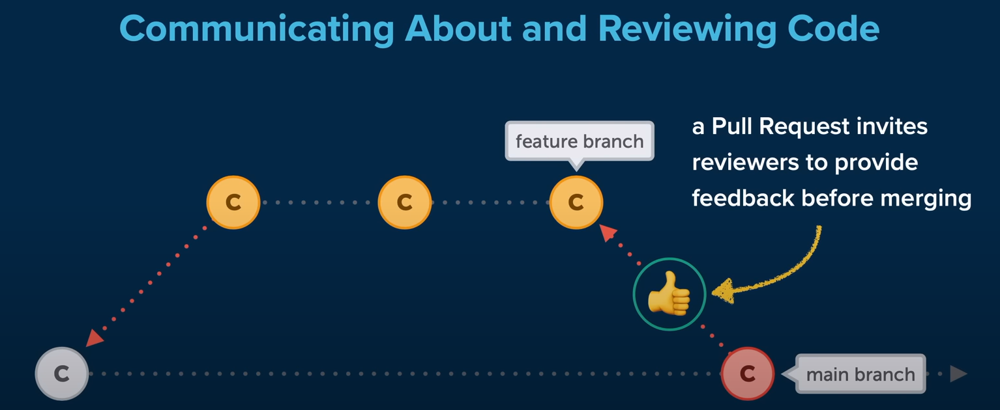

### Example: Using Pull Requests on GitHub

1. Fork the repository. This creates a copy of the repository in your GitHub account.
2. `git clone <forked-repository-url>` to clone the repository to your local machine.
3. `git checkout -b <branch-name>` to create a new branch.
4. Make changes, commit them, and push the branch to your forked repository.
5. Open a Pull Request: On GitHub, propose integrating your changes into the original repository.

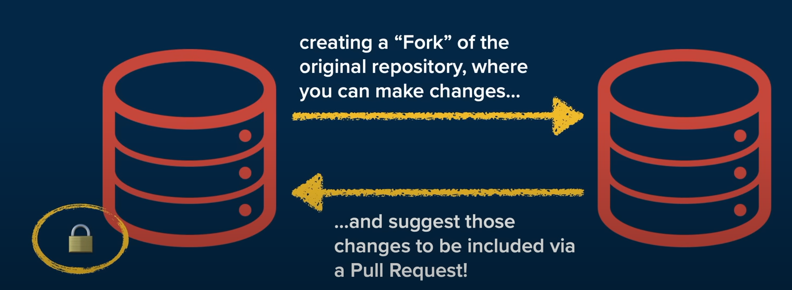

> - Alwyas before `push` make sure to `pull` to avoid conflicts.
> - `git pull origin main` this work if you are work on the original repository.
> - if you forked the repository and you want to update your forked repository with the original repository, to do that you need to add the original repository as a remote repository. `git remote add upstream <original-repository-url>` then `git pull upstream main` to pull the changes from the original repository to your forked repository. or you can use `git fetch upstream` then `git merge upstream/main`.

## Merge Conflicts

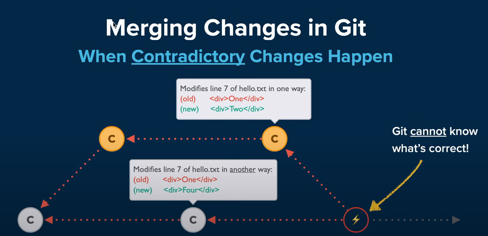

- `git merge`, `git rebase`, `git pull`, `git cheary-pick` or `git stash apply` can cause merge conflicts.

- Git will clearly notify you when a conflict occurs. Use `git status` to identify unmerged paths.

- ignore merge conflicts: `git merge --abort` or `git rebase --abort`.
- continue the merge: `git add <file>` then `git commit`. or `git merge --continue`. or `git rebase --continue`. after resolving the conflict.

- How to solve the conflict? simply cleanup the file and remove the conflict markers `<<<<<<<`, `=======`, `>>>>>>>`.

## Merge vs Rebase

### Merge

When Git performs a merge, it looks for three commits:

- Common Ancestor Commit: Where both branches had the same content.
- Latest Revisions: Endpoints of each branch.
- Git creates a new merge commit to connect the branches.

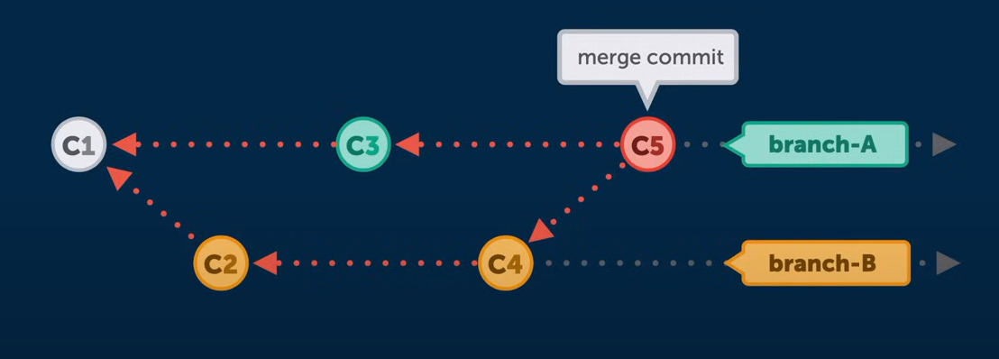

### Rebase

Rebase rewrites commit history to make development appear linear. It removes commits from one branch temporarily, applies new commits from another branch, and then reapplies the removed commits.

Important Rule: Do not rewrite commits that have already been pushed to a shared repository.

Instead use it for cleaning up your local commit hsitory before merging it into a shared team branch.

- `git rebase <branch>`: Rebase the current branch onto `<branch>`.
- git will remove all the commits from the current branch
- apply the commits from the `<branch>`
- apply the removed commits.

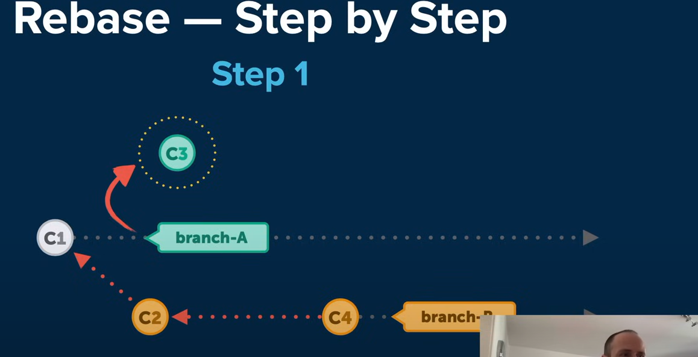

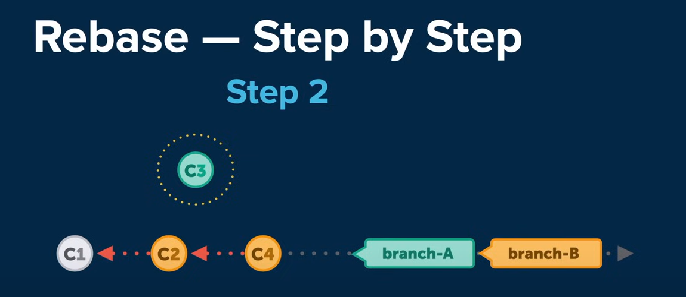

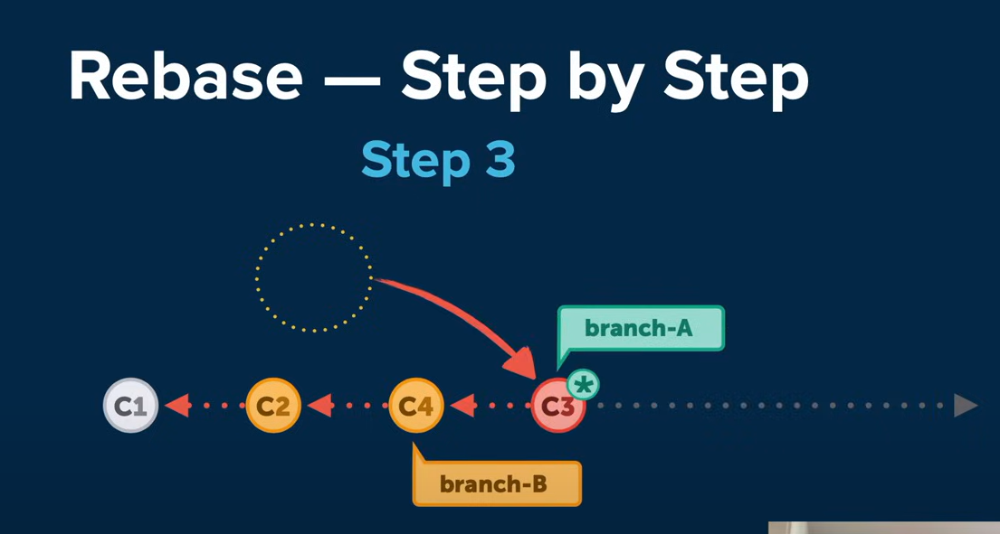

## Stash

Stash allows you to save changes temporarily and reapply them later. It's useful when you're not ready to commit changes but need to switch branches.

- `git stash` to save changes.
- `git stash list` to list stashes.
- `git stash pop` to reapply and remove the last stash.
- `git stash apply` to reapply the last stash.
- `git stash save <name>` to save a named stash.
- `git stash apply <stash_index>` to reapply a specific stash.
- `git stash drop` to remove the last stash.
- `git stash clear` to remove all stashes.
