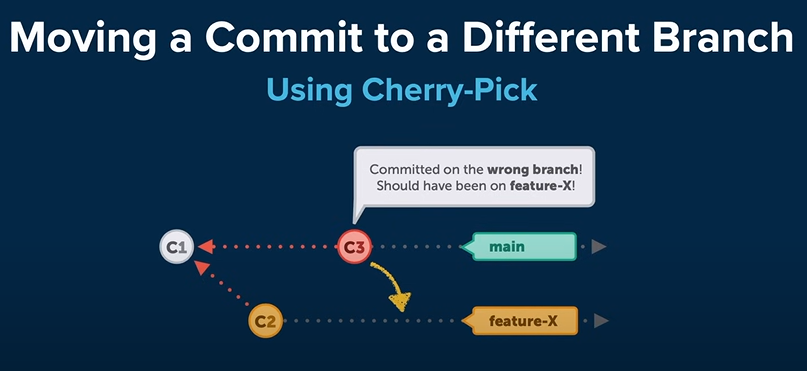
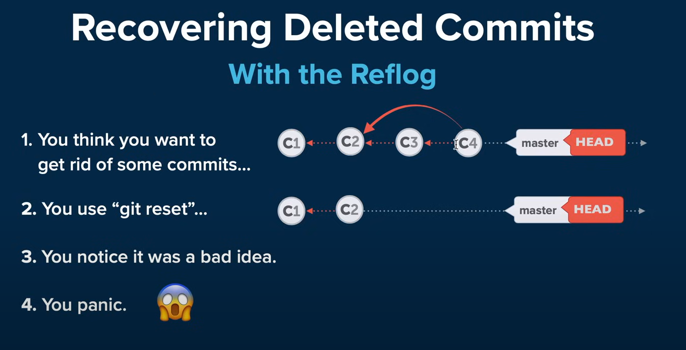
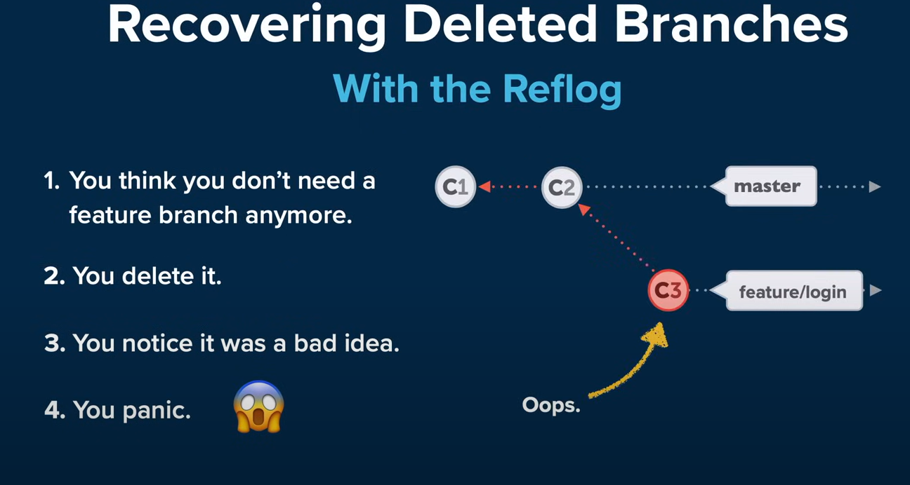

# Advanced Git Tutorial

## Interactive Rebase => (Weak in this section)

- change a commit's message
- delete commits
- reorder commits
- combine multiple commits into one
- edit / split an existing commit intomultiple new ones

1. How far back do you want to go?
2. `git rebase -i HEAD~3` to go back 3 commits. to go back to the first commit use `git rebase -i --root`.
3. `pick` to keep the commit as is.
4. `reword` to change the commit message.
5. `squash` to combine the commit with the previous commit.

## Cherry-Pick

Suppose you accidentally committed on the master branch instead of the feature/newsletter branch.

- `git checkout feature/newsletter` to switch to the feature/newsletter branch.
- `git cherry-pick <commit-hash>` to copy the commit from the master branch to the feature/newsletter branch.
- Clean Up the Master Branch (Optional):
  - `git checkout master` to switch to the master branch.
  - `git reset --hard HEAD~1` to remove the last commit from the master branch.

## Reflog

The reflog is Git's diary, logging every movement of the HEAD pointer. It's invaluable for undoing mistakes.

1. `git reset --hard <commit-hash>` to go back to a previous commit. or `git reset --hard HEAD~1` to go back one commit.
2. `git reflog` to see the history of the HEAD pointer.
3. `git reset <commit-hash>` to go back to a previous commit.

> `git checkout -b <branch-name> <commit-hash>` to create a new branch from a previous commit.

also if you remove branch by mistake you can recover it by using `git reflog` and see when you checkout to another branch and then you can recover it by `git checkout -b <branch-name> <commit-hash>`.

## Revert

Revert is a safe way to undo changes. It creates a new commit that undoes the changes from a previous commit.

- `git revert <commit-hash>` to undo the changes from a previous commit.
- `git revert HEAD` to undo the last commit.
- `git revert HEAD~2` to undo the last 2 commits.

## Submodules

Submodules allow you to keep a Git repository as a subdirectory of another Git repository. They are useful for including third-party libraries without mixing external code with your project files.

- Before this approach: you have to copy the code from the third-party library and paste it into your project. (ugly approach)

- `git submodule add <repository-url>` to add a submodule to your project.

## Search and Find

You can filter your commit history by various criteria:

- By Date `git log --after="2023-07-01" --before="2023-07-05"`
- By Commit Message `git log --grep="refactored"`
- By Author `git log --author="Heinemeier"`
- By File `git log -- README.md`
- By Branch Differences `git log feature/login..main` (commits in main that are not in feature/login)
